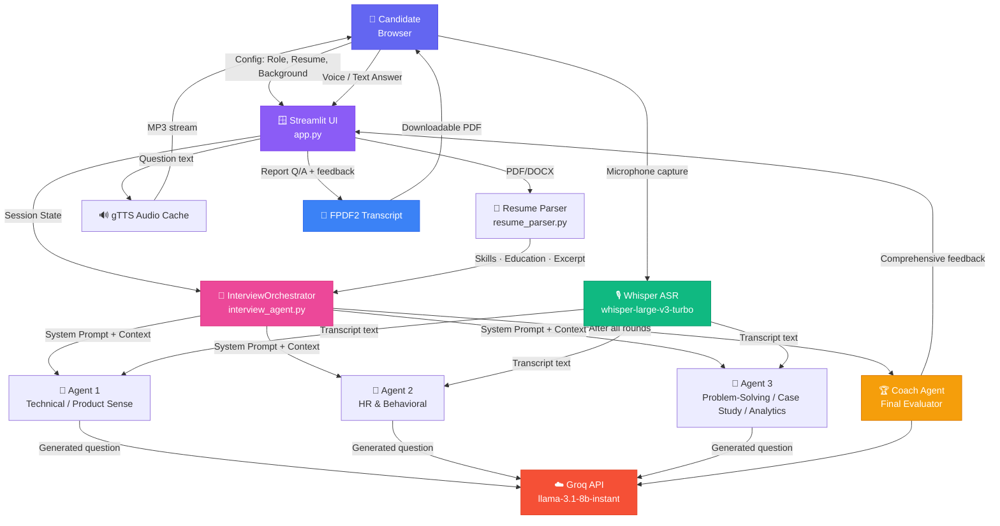

<div align="center">

<!-- ANIMATED TYPING HEADER -->


<br>


<!-- BADGES — replace after first releases -->
<p>
  <a href="https://github.com/girish-indurkar/MockMate-Multi-agentAi-Mock-Interview-Platform/stargazers"></a>
  <a href="https://github.com/girish-indurkar/MockMate-Multi-agentAi-Mock-Interview-Platform/network/members"></a>
  <a href="https://github.com/girish-indurkar/MockMate-Multi-agentAi-Mock-Interview-Platform/issues"></a>
  <a href="https://github.com/girish-indurkar/MockMate-Multi-agentAi-Mock-Interview-Platform/pulls"></a>
</p>

<p>
  
  
  
  
  
  
</p>

<p>
  
  
  
  
</p>

<br/>

**A sophisticated multi-agent AI system that conducts realistic mock interviews across 3 target roles with 3 distinct rounds each — powered by Groq's ultra-fast inference, with personalized difficulty, voice interaction, single-question card UI, and downloadable PDF transcripts.**

[🚀 Live Demo](#-quick-start) · [📚 Architecture](#-architecture) · [🎥 Demo](#-demo) · [📖 Docs](#-quick-start) · [⭐ Star](#-support) · [🐛 Report Bug](https://github.com/girish-indurkar/MockMate-Multi-agentAi-Mock-Interview-Platform/issues)

</div>

---

## 📑 Table of Contents

- [🌟 Hero Highlights](#-hero-highlights)
- [✨ Features](#-features)
- [🎥 Demo](#-demo)
- [🏗 Architecture](#-architecture)
- [🛠 Tech Stack](#-tech-stack)
- [⚡ Quick Start](#-quick-start)
- [📁 Project Structure](#-project-structure)
- [🔐 Environment Variables](#-environment-variables)

- [🎯 Usage](#-usage)
- [🤔 Difficulty Inference](#-difficulty-inference)
- [⚖️ Key Design Decisions & Tradeoffs](#-key-design-decisions--tradeoffs)
- [🧪 Example Interview Transcripts](#-example-interview-transcripts)

- [❓ FAQ](#-faq)
- [🙌 Acknowledgements](#-acknowledgements)

---

## 🌟 Hero Highlights

<div align="center">

| 👥 **Multi-Agent** | ⚡ **Groq-Powered** | 🎙 **Voice-First** | 🎯 **Adaptive Difficulty** |
|:---:|:---:|:---:|:---:|
| specialized AI agents orchestrated across 3 rounds | Llama-3.1-8B-Instant + Whisper-Large-v3-Turbo | Real-time speech-to-text + text-to-speech | Adjusts to fresher, mid, or senior candidate |

| 🪪 **Resume-Aware** | 🪟 **Single-Question UI** | 📄 **PDF Reports** | 🧠 **Coach Feedback** |
|:---:|:---:|:---:|:---:|
| Parses PDF/DOCX resume to contextualize every prompt | Distraction-free glassmorphic card layout | Downloadable, formatted transcripts | Comprehensive post-round growth plan |

</div>

---

## ✨ Features

<div align="center">

| | Feature | Description |
|---|---|---|
| 🤖 | **Multi-Agent Orchestration** | Three role-specialized agents  collaborate via a central state machine. |
| 🧠 | **Background-Aware Difficulty** | Auto-infers *beginner · intermediate · advanced* from resume + free-text background and injects guidance into every prompt. |
| 🎤 | **Voice Mode** | Streamlit `audio_input` → Groq Whisper-Large-v3-Turbo for ASR; gTTS for question playback with in-session audio cache. |
| 💬 | **Text Mode** | Distraction-free text answer box powered by Llama-3.1-8B-Instant via Groq's ultra-low-latency inference. |
| 🎨 | **Glassmorphic UI** | Centered single-question card, gradient buttons, agent badges, and a focus-first interview flow. |
| 📄 | **PDF Transcript Export** | Cleanly typeset report with role, background, every Q/A, and the Coach's comprehensive feedback (FPDF2). |
| 📥 | **Resume Parsing** | PDF/DOCX ingestion extracts skills, education, and snippets via PyPDF2 and python-docx. |
| 🔄 | **Stateless but Contextual** | Conversation context is injected into each prompt — infinite horizontal scale, no DB required. |
| 🛡 | **Error-Tolerant** | Graceful handling across ASR/TTS/LLM failures fallback with clear UI feedback. |
| 🧩 | **Modular Architecture** | `interview_agent.py` (orchestration), `prompts.py` (role prompts), `resume_parser.py` (ingestion), `app.py` (UI). |

</div>

---

## 🎥 Demo

<div align="center">

> **Coming Soon:** Recorded walkthrough covering interview flow, Coach feedback, and PDF export.
>
> 📺 Subscribe to updates: [Watch this repo](https://github.com/girish-indurkar/MockMate-Multi-agentAi-Mock-Interview-Platform/subscription)

</div>


---

## 🏗 Architecture

<div align="center">



</div>

### Component Responsibilities

| Layer | File | Responsibility |
|---|---|---|
| **UI Layer** | `app.py` | Streamlit presentation, glassmorphic styling, voice + text input, audio caching, PDF export. |
| **Orchestration** | `interview_agent.py` | `InterviewOrchestrator` state machine + `InterviewAgent` wraps Groq client and history. |
| **Prompt Engineering** | `prompts.py` | Role × Round × prompt-type matrix (system + evaluator). |
| **Ingestion** | `resume_parser.py` | PyPDF2 + python-docx extraction → structured context for prompts. |
| **External APIs** | Groq Cloud | LLM inference + Whisper ASR. |
| **Persistence** | None (stateless) | Conversation history lives in `st.session_state` only. |

---

## 🛠 Tech Stack

<div align="center">

<p>
  
  
  
  

  
  
  
  
  
  
  

  
  
  
  
</p>
</div>
MockMate is built using the following technologies:

*   **Python**: The core programming language.
*   **Streamlit**: For creating the interactive web application interface.
*   **Groq API**: Powers the multi-agent AI interviewers for fast and intelligent responses.
*   **`python-dotenv`**: Manages environment variables for secure API key handling.
*   **`PyPDF2`**: Used for parsing text from PDF resumes.
*   **`python-docx`**: Used for parsing text from DOCX resumes.
*   **`gTTS` (Google Text-to-Speech)**: Enables voice output for AI responses.
*   **`fpdf2`**: For generating downloadable PDF interview reports.
*   **`requests`**: For making HTTP requests (general utility, potentially for external APIs).

---

## ⚡ Quick Start

### ✅ Prerequisites

- **Python 3.8+** ([download](https://www.python.org/downloads/))
- **Groq API Key** — free at [console.groq.com](https://console.groq.com/)
- `git` installed

### Installation

1.  **Clone the repository:**
    ```bash
    git clone https://github.com/girish-indurkar/MockMate-Multi-agentAi-Mock-Interview-Platform.git
    ```
    ```bash
    cd MockMate-Multi-agentAi-Mock-Interview-Platform
    ```

2.  **Create a virtual environment (recommended):**
    ```bash
    python -m venv venv
    # On Windows
    .\venv\Scripts\activate
    # On macOS/Linux
    source venv/bin/activate
    ```

3.  **Install the required dependencies:**
    ```bash
    pip install -r requirements.txt
    ```

4.  **Set up environment variables:**
    Create a `.env` file in the root directory of the project and add your Groq API key:
    ```
    GROQ_API_KEY="your_groq_api_key_here"
    ```
    Replace `"your_groq_api_key_here"` with your actual API key.

### 🚀 Launch the App

```bash
streamlit run app.py
```

Then open <http://localhost:8501> in your browser.

---

## 📁 Project Structure

```text
MockMate-Multi-agentAi-Mock-Interview-Platform/
├── Prompts/
│   ├── Sde.py
│   ├── data_scientist.py
│   ├── product_manager.py
│   └── __init.py__
├── app.py
├── example_interviews.json
├── interview_agent.py
├── prompts.py
├── README.md
├── requirements.txt
└── resume_parser.py
```

---

## 🔐 Environment Variables

| Variable | Required | Default | Description |
|---|---|---|---|
| `GROQ_API_KEY` | ✅ Yes | — | Groq Cloud API key used by `groq` SDK for both LLM + Whisper calls. Get a free key at [console.groq.com](https://console.groq.com/). |

> ⚠️ **Never commit your `.env` file.** The repository's `.gitignore` already excludes it.

---


## 🎯 Usage 

1.  **Run the Streamlit application:**
    ```bash
    streamlit run app.py
    ```

2.  **Access the application:**
    Open your web browser and navigate to the URL displayed in your terminal (usually `http://localhost:8501`).

3.  **Start your mock interview:**
    *   Upload your resume (PDF or DOCX) to provide context for the AI.
    *   Select your desired job role (e.g., SDE, Data Scientist, Product Manager).
    *   Choose the interview round you want to practice (e.g., Technical, HR).
    *   Interact with the AI interviewer using the chat interface.
    *   At the end of the session, download your personalized interview report.

---

### 🤔 Difficulty Inference

The orchestrator parses free-text background into `beginner · intermediate · advanced`:

| Trigger in background text | Inferred difficulty |
|---|---|
| `fresher`, `student`, `intern`, `0–1 year`, `final year` | **beginner** |
| `1–3 years`, mid-level keywords | **intermediate** |
| `4+ years`, staff / principal keywords, `architect` | **advanced** |

### 📄 Parse a Resume

```python
from resume_parser import extract_resume_info, format_resume_context

info = extract_resume_info("./cv.pdf")
context = format_resume_context(info)
# Inject into orchestrator for hyper-personalized prompts
```

---

## ⚖️ Key Design Decisions & Tradeoffs

### 1. 🏎  Groq (Llama-3.1-8B-Instant + Whisper-Large-v3-Turbo) for the LLM stack

- **Decision:** Use Groq's ultra-low-latency hosted inference for both Q generation and ASR.
- **Tradeoff:** A smaller model + faster inference beats a larger model with high latency for a *conversational* interview app. We trade raw reasoning ceiling for sub-second perceived response times, which is critical when the agent is also playing back questions via TTS.

### 2. 🪟  Single-Question Card UI

- **Decision:** Hide chat history and surface only the active question inside a glass card.
- **Tradeoff:** Lower cognitive load and aggressively simulates a real interview (focus on *this* prompt), but the candidate can no longer re-scan earlier answers mid-round. We compensate by surfacing the agent badge and round progress above the card.

### 3. 🗣  Client-Side TTS + Server-Side ASR

- **Decision:** Use `gTTS` for question playback (cached in `st.session_state`) and stream audio to Whisper-Large-v3-Turbo from the server.
- **Tradeoff:** `gTTS` is free and zero-config but emotionally flat. Whisper on the server keeps the user's machine free of large model weights while delivering strong multilingual accuracy.

### 4. 🔁  Stateless Agents with Prompt-Injected Context

- **Decision:** Every agent is a fresh request — the orchestrator injects the prior Q & A into the *next* call's prompt.
- **Tradeoff:** Horizontal scale is trivial (no DB, no vector store) but token cost grows linearly with conversation length. We cap summary length in the Coach prompt to stay safely under Groq's TPM limits.

### 5. 🧠  Resume + Background → Difficulty Inference

- **Decision:** Run a lightweight keyword/regex pass on free-text background; append a difficulty block to every system prompt.
- **Tradeoff:** Heuristic inference is faster than asking a model, but it can misclassify rare phrasings ("5 YOE at a startup"). The UI exposes the inferred difficulty so the candidate can sanity-check it.

### 6. 🚫  No Persistent Storage

- **Decision:** All state lives in `st.session_state`. Nothing is written to disk beyond an optional PDF download.
- **Tradeoff:** Restarts wipe the in-flight interview. Acceptable for a practice tool and a major privacy win — candidate transcripts never touch a database.

---

## 🧪 Example Interview Transcripts

The platform adapts question difficulty and agent style to the candidate's profile. Abbreviated samples below are taken from `example_interviews.json`.

### 1️⃣  Strong Candidate — SDE, 5 YOE

| Field | Value |
|---|---|
| **Profile** | 5 years backend at Google · strong DSA · distributed systems |
| **Round** | Technical |
| **Difficulty** | `advanced` |

> **🤖 Agent:** "Design an LRU Cache. What's your approach?"
>
> **👤 Candidate:** "HashMap for O(1) lookups combined with a doubly-linked list to maintain insertion order…"
>
> **🤖 Agent:** "Solid. How would you handle concurrency?"
>
> **👤 Candidate:** "ReentrantReadWriteLock — concurrent reads, exclusive writes…"

> 🏆 **Coach:** *Excellent technical fundamentals. Deep systems intuition. Could probe deeper into CAP trade-offs on partition behavior.*

### 2️⃣  Weak Candidate — Data Scientist, Fresher

| Field | Value |
|---|---|
| **Profile** | Fresher · bootcamp graduate |
| **Round** | Technical |
| **Difficulty** | `beginner` |

> **🤖 Agent:** "Explain the difference between supervised and unsupervised learning."
>
> **👤 Candidate:** "Supervised has labels. Unsupervised doesn't."
>
> **🤖 Agent:** "Correct, but brief — can you give an example of an algorithm for each?"
>
> **👤 Candidate:** "Linear regression for supervised. I don't remember any for unsupervised."

> 🏆 **Coach:** *Foundational gaps in unsupervised methods. Recommend K-Means & PCA walk-throughs plus STAR-format answers to deepen technical communication.*

### 3️⃣  Edge-Case Candidate — PM, Marketing → PM

| Field | Value |
|---|---|
| **Profile** | Experienced marketer switching to PM · deflects quantitative questions |
| **Round** | Product Sense |
| **Difficulty** | `intermediate` |

> **🤖 Agent:** "How would you design a metric to track engagement for a newly launched feature?"
>
> **👤 Candidate:** "Look at tweets about it and our marketing campaign sentiment."
>
> **🤖 Agent:** "Marketing sentiment helps, but how do you measure in-app product engagement from internal telemetry?"
>
> **👤 Candidate:** "Engineering handles data logging — as long as users are happy, that's what matters."

> 🏆 **Coach:** *Candidate deflects analytics. Coach-evaluated gap: product-specific telemetry. Recommend defining concrete engagement KPIs and practicing "What's the leading indicator?" framing.*

---

---

## ❓ FAQ

<details>
<summary><b>❓ Do I need a paid Groq account?</b></summary>

No — Groq Cloud offers a generous free tier that's enough for hundreds of mock interviews. Grab a key at [console.groq.com](https://console.groq.com/).
</details>

<details>
<summary><b>❓ Why Llama-3.1-8B-Instant and not a 70B model?</b></summary>

Latency. A mock interview is conversational — every second of silence breaks immersion. 8B-Instant delivers near-zero time-to-first-token while remaining coherent enough for structured Q&A. The Coach pass uses reasoned summarization and still completes inside a few seconds.
</details>

<details>
<summary><b>❓ Why gTTS instead of a neural TTS?</b></summary>

Zero cost, zero API key, and zero infrastructure. The tradeoff is a flatter prosody — if you'd like warmer voice, swap `generate_audio_bytes()` in `app.py` for ElevenLabs or OpenAI Audio (tracked on the Roadmap).
</details>

<details>
<summary><b>❓ Can I use this without a microphone?</b></summary>

Yes. Pick **Text** mode in the sidebar — the same agents, the same difficulty adjustment, just typed input.
</details>

<details>
<summary><b>❓ Is my interview data stored anywhere?</b></summary>

No. All state lives in Streamlit session memory. Nothing is written to disk beyond an optional PDF you download yourself.
</details>

<details>
<summary><b>❓ How is difficulty inferred?</b></summary>

`infer_difficulty()` in `interview_agent.py` scans your free-text background for keywords (e.g. *fresher*, *5 years*) and regex year matches, then appends a tailored instruction block to every system prompt. The UI surfaces the inferred level so you can confirm it.
</details>

<details>
<summary><b>❓ Can I add a new role (e.g., DevRel, ML Engineer)?</b></summary>

Yes — add a new entry to `PROMPTS[role]` in `prompts.py` (system + evaluator prompts) and a `rounds_map[role]` entry in `InterviewOrchestrator._get_rounds_for_role()`.
</details>

---

## 🙌 Acknowledgements

- [Groq](https://groq.com/) — ultra-fast LPU inference that makes conversational AI feel instantaneous.
- [Meta Llama](https://llama.meta.com/) — open-weights foundation model powering the agentic reasoning.
- [OpenAI Whisper](https://openai.com/research/whisper) — robust multilingual ASR for the voice pipeline.
- [Streamlit](https://streamlit.io/) — the fastest path from Python script to beautiful web app.
- [FPDF2](https://py-pdf.github.io/fpdf2/) — clean, dependency-free PDF generation.
- The open-source community whose patterns inspired the glassmorphic UI and stateful orchestrator design.

---

